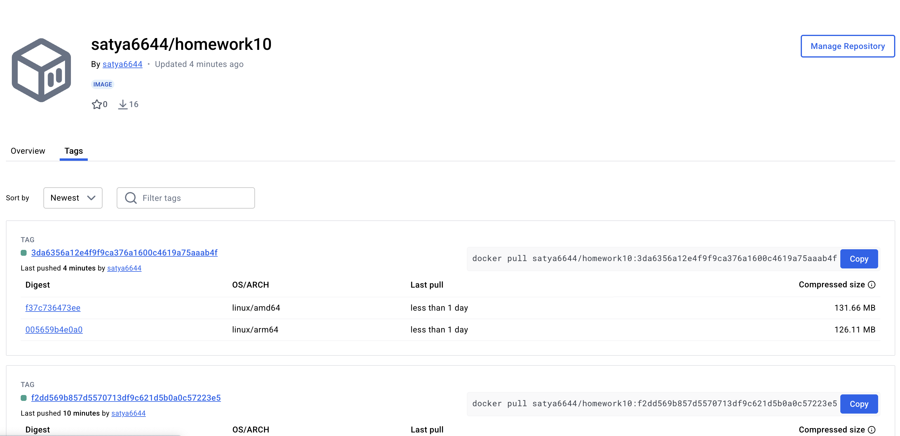
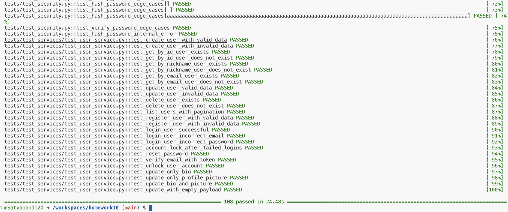

# Event Manager Company · Onboarding Assignment

Welcome to this repository – a journey as a Software QA Analyst/Developer at Event Manager Company. This isn't just a codebase. It’s a deep dive into how I embraced testing, validation, and debugging to shape a robust and secure REST API.

---

## 🚀 Project Essence

The core of the project is a FastAPI-based backend that enables secure user management via JWT-authenticated endpoints. I joined with the goal of auditing and improving both functionality and reliability — not just as a developer, but as a QA-first engineer.

I containerized the project using Docker and connected it to PostgreSQL and PGAdmin, making local dev and test cycles smooth and fast. Once up, the API was accessible at `http://localhost/docs` and the database GUI at `http://localhost:5050`.

---
### 🐳 Docker Compose

---

## ✅ Test Results

The application passed all test cases and achieved **95% test coverage**.

## 🧠 What I Fixed and Why It Mattered

Rather than just fixing bugs, I treated each issue like an opportunity to improve developer experience and user safety.

- **[Nickname Validation (#9)](https://github.com/Satyabandi20/homework10/issues/9):** Users could submit weird nicknames like “john@doe”, which passed silently. I fixed the regex, added custom messages, and ensured minimum length enforcement.
  
- **[Password Strength (#11)](https://github.com/Satyabandi20/homework10/issues/11):** The original validation was lax. I enforced a secure password policy requiring uppercase, lowercase, digits, and special characters — and backed it with solid tests.

- **[Email Fixture Test Failures (#7)](https://github.com/Satyabandi20/homework10/issues/7):** Existing tests were brittle due to missing or incorrect email service mock fixtures. I refactored the setup and cleaned up the test suite.

- **[Schema Mismatches (#5)](https://github.com/Satyabandi20/homework10/issues/5):** Some `UserCreate` and `UserResponse` schemas lacked fields or had incorrect types compared to the model. I synchronized all contracts with testable models.

- **[Profile Edge Cases (#15)](https://github.com/Satyabandi20/homework10/issues/15):** I validated combinations like updating only bio, only profile picture, or both — making sure they didn’t silently fail or overwrite unintended fields.

- **[Token Fixtures & Auth Coverage (#1)](https://github.com/Satyabandi20/homework10/issues/1):** Tests needing tokens were failing. I implemented token fixtures for different roles (user, manager, admin) and ensured proper test isolation.

- **[Trivy Vulnerability Scan (#13)](https://github.com/Satyabandi20/homework10/issues/13):** I addressed high/critical issues (CVE-2024-36039, CVE-2024-33663, etc.) by updating versions in `requirements.txt` to secure the stack without breaking the build.

- **[Duplicate Nickname Fixture (#3)](https://github.com/Satyabandi20/homework10/issues/3):** Some test fixtures reused nicknames, causing uniqueness violations. I fixed it by using `faker.unique.user_name()` and resetting between tests.

---

## 🧪 Testing Philosophy

Testing wasn’t just a requirement — it was a mindset. I didn’t stop at getting the tests to pass. I wrote edge cases, fuzz-style validators, and negative scenarios. Even things like invalid URLs and blank updates got coverage.

Test coverage now exceeds **95%**, and every bug I fixed is backed by automated tests.

---

## 📸 Docker Snapshot

Yes, the app runs perfectly inside containers. You’ll find:
- API: [localhost:8000/docs](http://localhost:8000/docs)
- PGAdmin: [localhost:5050](http://localhost:5050)
- Tests: Green ✅, Coverage: High 📈

---

## 🔁 Reflection

This assignment made me look beyond “just passing tests.” It taught me how to align database models with schemas, how fragile tests can be without proper fixtures, and how important secure validation is in public-facing APIs.

Debugging OAuth flows and crafting JWT tests helped me think like both a developer and a hacker. Writing test cases before writing fixes helped reduce bugs significantly. And working with Git branches, pull requests, and structured commits made collaboration feel clean and efficient.

I walked in as a coder.
I walked out as a contributor.

---

🧾 Authored by [Satyabandi20](https://github.com/Satyabandi20)
